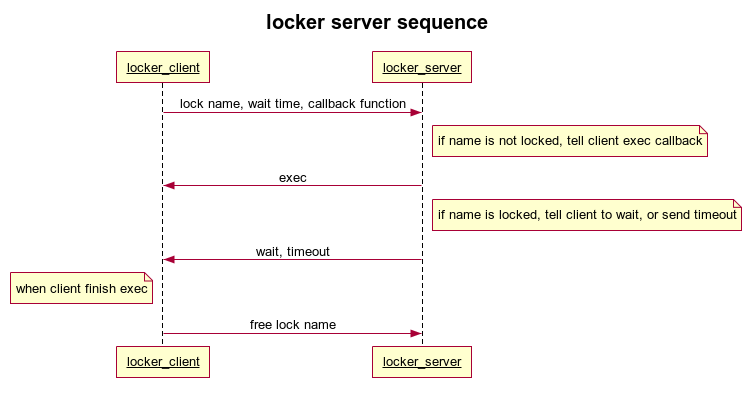
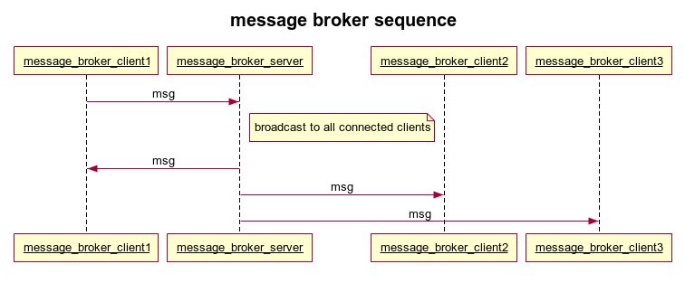
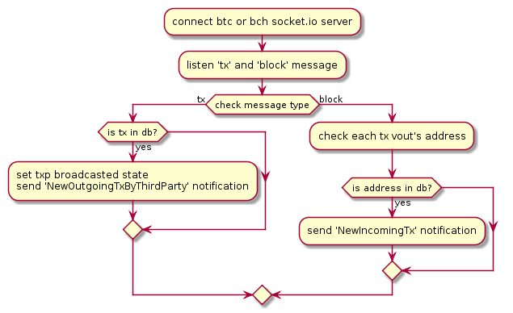
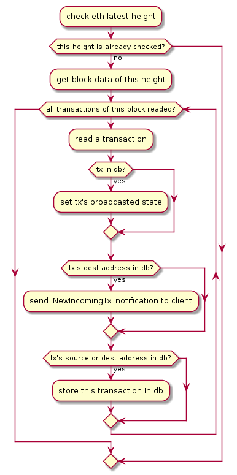
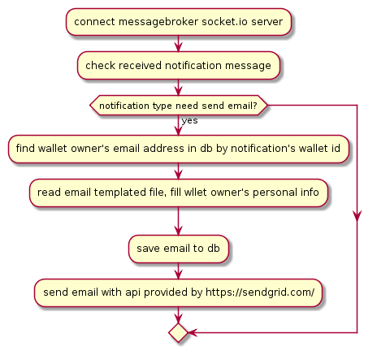
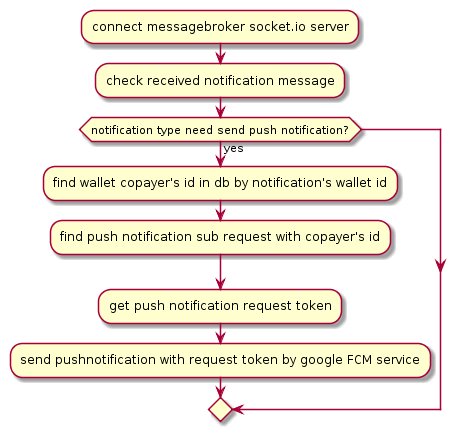

# **bitcore-wallet-service代码架构说明**

## 源代码主要目录功能介绍

|  目录名称    |    主要功能  |
| ----------------------------------------- | ---- |
| bcmonitor                                    |  后台监测和扫描区块的进程入口    |
|  emailservice                                         |   邮件服务进程入口   |
|       fiatrateservice          |   交易费率后台更新进程入口   |
|      lib                                     | 非入口的的实现代码     |
|       lib/blockchainexplorers             |    和区块链数据的rpc接口交互 |
|       lib/common                                    |   各币种的通用功能   |
|       lib/errors                         |  定义返回给客户端的错误信息    |
|       lib/fiatrateproviders                 |    与提供交易费率的接口交互  |
|       lib/model                      |     数据库存储模型的封装 |
|     lib/templates                    |  邮件和通知的内容模板    |
|     locker                  |    进程间操作同步的服务  |
|    messagebroker             |    进程间消息转发的服务  |
|      pushnotificationsservice        |  提供通知服务的进程入口    |
|        scripts  |    操作mongodb的脚本文件  |
|          test                                 |单元测试      |

## 各进程总体流程介绍

bitcore-wallet-service是一个多进程协作的项目。项目的启动文件在start.sh，这个脚本启动了9个进程，主要入口和功能如下：

| 进程入口     | 主要功能     |
| ---- | ---- |
| locker/locker.js     |  进程间同步加锁服务    |
|   messagebroker/messagebroker.js   |  进程间传递消息的服务    |
|  bcmonitor/bcmonitor.js    | 监测和扫描比特币的区块数据     |
|    bcmonitor/bcmonitorEth.js  |  监测和扫描ETH的区块数据    |
|   bcmonitor/bcmonitorTri.js    | 监测和扫描trias v1节点的区块数据     |
|   emailservice/emailservice.js   |   给客户端发送邮件   |
|   pushnotificationsservice/pushnotificationsservice.js   |   给客户端发送通知   |
|     fiatrateservice/fiatrateservice.js |    更新交易费率信息  |
| bws.js |  提供http服务的进程入口|

### locker进程介绍

locker进程使用了开源库locker-server，默认监听3231端口。locker进程为客户端提供了跨进程的锁定同步。主要流程如下图：

### messagebroker进程介绍

messagebroker进程使用了开源库socket.io，默认监听3380端口。messagebroker进程实际上就是个简单的socket.io的服务器，把收到的所有消息，都广播给当前连接的所有客户端。主要流程如下图：

### bcmonitor进程介绍

bcmonitor进程连接提供btc和bch区块数据的socket.io服务器，监听每一个区块的交易，如果本地数据库有和交易相关的信息，就处理这个交易。主要流程如下图：

### bcmonitorEth进程介绍

bcmonitorEth进程定时轮询eth数据服务器，解析每一个区块的交易，如果本地数据库有和交易相关的信息，就处理这个交易。主要流程如下图：

### bcmonitorTri进程介绍

bcmonitorTri进程轮询tri v1版的公链节点。因为tri v1版的rpc接口，完全兼容以太坊。因此bcmonitorTri进程的流程，和bcmonitorEth进程完全一样。可以参考bcmonitorEth进程的流程图。

### emailservice进程介绍

emailservice进程实际是messagebroker进程的一个客户端，监听messagebroker进程广播的消息，如果收到需要发送邮件的消息，则给钱包的所有者发送邮件。主要流程如下图：

### pushnotificationsservice进程介绍

pushnotificationsservice进程和emailservice进程类似，也是是messagebroker进程的一个客户端，监听messagebroker进程广播的消息，如果收到需要发送push通知的消息，则给订阅通知的钱包所有者发送通知。主要流程如下图：

### fiatrateservice进程介绍

fiatrateservice进程的逻辑比较简单，每小时从bitpay的服务器，请求一次btc和bch的最新交易费率，然后保存在数据库中，供客户端查询。

### bws进程介绍

bws进程是项目的主要进程，使用express框架，对外提供http api服务。具体的api接口可以参考文档 [bws api接口文档](https://dasenlincode.github.io/bws_api_doc) 。

